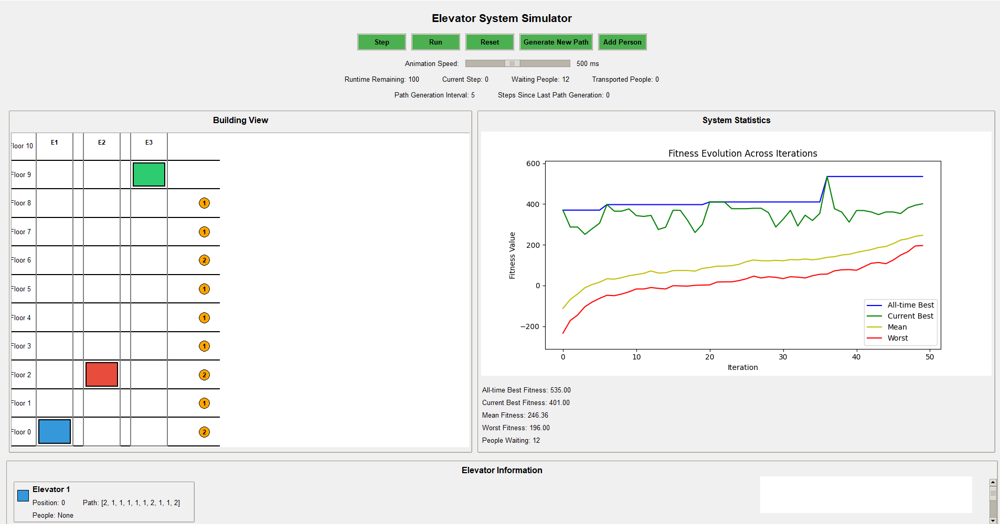

# Elevator Simulation System

A genetic algorithm-based elevator control system simulation that optimizes elevator movement and passenger handling in multi-floor buildings.



## Overview

This project simulates an intelligent elevator control system that optimizes elevator routing using genetic algorithms. The system aims to minimize waiting times and improve passenger satisfaction by generating efficient paths for multiple elevators.

> **Note:** The graphical user interface (GUI) components of this project were generated with the assistance of AI tools. The core algorithm implementation and system architecture were manually developed.

## Features

- **Genetic Algorithm Optimization**: Continuously improves elevator movement patterns
- **Multi-Elevator Support**: Coordinates multiple elevators in a building
- **Realistic Passenger Simulation**: Models passenger behavior with varied start and destination floors
- **Performance Metrics**: Evaluates system performance through multiple fitness criteria
- **Real-time Path Generation**: Dynamically adapts to changing passenger demands

## System Architecture

The system consists of several key modules:

### Algorithm
- Genetic algorithm implementation for elevator path optimization
- Crossover and mutation operations
- Fitness evaluation based on multiple criteria
- Tabu search for path generation and validation

### Managers
- People management across the system
- Conversion between system representations

### Objects
- Elevator, Person, and Path state representations
- Solution representation for the genetic algorithm

### Settings
- Configurable parameters for the system

## How It Works

The genetic algorithm optimizes elevator paths by:
1. Generating an initial population of possible path solutions
2. Evaluating fitness based on waiting time, travel efficiency, and passenger satisfaction
3. Applying crossover and mutation to create new solutions
4. Selecting the best solutions for the next generation
5. Repeating until an optimal solution is found


## Installation

### Prerequisites
- Python 3.12+
- Required packages listed in requirements.txt:
  - coverage==7.6.1
  - iniconfig==2.0.0
  - pylint==3.3.1
  - pytest==8.3.1
  - typing_extensions==4.12.2
  - matplotlib==3.9.0

### Setup

1. Clone the repository:
```bash
git clone https://github.com/yourusername/elevator-simulation.git
cd elevator-simulation
```

2. Install dependencies:
```bash
pip install -r requirements.txt
```

## Usage

### GUI Version
To run the simulation with the graphical interface:

```bash
python src/Gui/Gui.py
```

### Docker (Algorithm Testing Only)
The Docker setup is available for testing the algorithm without the GUI. Note that the GUI won't work properly in Docker due to Tkinter limitations.

#### Using Docker Directly

1. Build the Docker image:
```bash
docker build -t elevator-simulation .
```

2. Run algorithm tests:
```bash
docker run elevator-simulation pytest tests
```

#### Using Docker Compose

You can also use Docker Compose for a more streamlined experience:

```bash
docker compose up
```

This will run the application using the configuration specified in compose.yaml.

### Customization

You can customize the simulation by modifying values in `src/Settings/SettingsSubclasses.py`:
- Number of elevators
- Number of floors
- Elevator capacity
- Genetic algorithm parameters

## Testing

Run the tests with:

```bash
pytest tests
```

Coverage reports can be generated with:

```bash
coverage run -m pytest tests
coverage report
```

## License

This project is licensed under the MIT License.